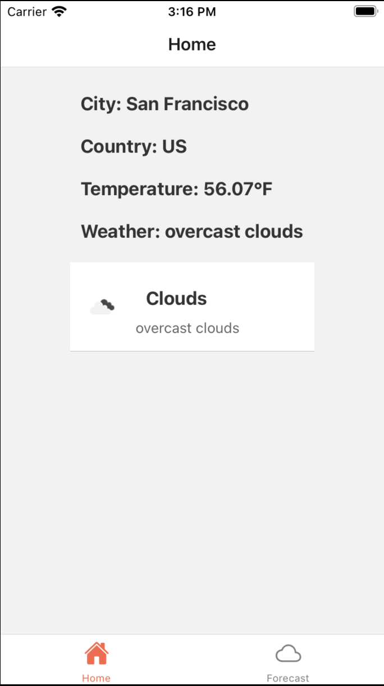
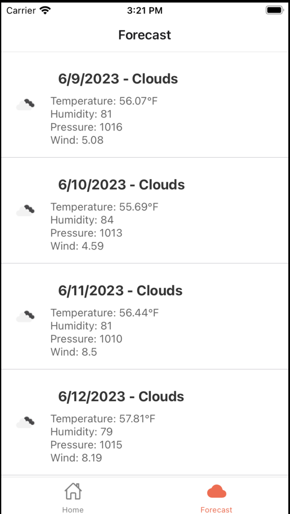

# Weather Forecast Application

A simple mobile application built with React Native and Expo, which displays the current weather conditions and a 5-day weather forecast for the user's current location.

## Prerequisites

Before you begin, ensure you have met the following requirements:

- You have a recent version of Node.js installed (at least Node 14 is recommended).
- You have an OpenWeather API key. If you don't have one, you can get it for free by registering on the [OpenWeather website](https://home.openweathermap.org/users/sign_up).

## Getting Started

To install this application, follow these steps:

### Clone the repository

```bash
git clone https://github.com/github/WeatherApp.git
cd WeatherApp
```

```bash
npm install
```

### Setup environment variables

##### Copy the .env.json.example file to a new file in the root directory called .env.json.

##### In the .env.json file, replace 'YOUR_OPEN_WEATHER_API_KEY' with your OpenWeather API Key.

```bash
{
  "API_KEY": "YOUR_OPEN_WEATHER_API_KEY",
  "API_URL": "https://api.openweathermap.org/data/2.5",
  "WEATHER_URL": "https://openweathermap.org"
}
```

### Running the applicaiton

```bash
expo start
```

### Home Screen



### Forecast Screen


